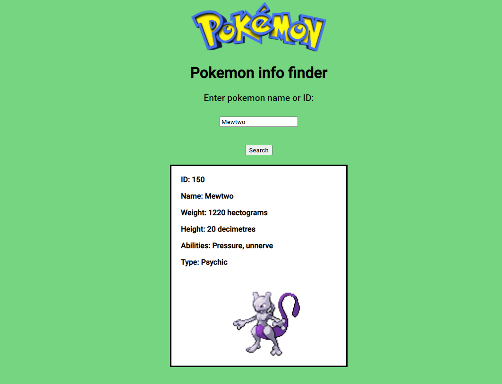

# Pokemon-info-finder
 
 You can access this project with this link: https://vigorous-fermi-2934a8.netlify.app/ 
 
 This web application allows you to type in either the ID or name of a pokemon, which will then display the information that pertains to this pokemon.

This project uses PokeApi (https://pokeapi.co/), HTML, CSS, and Javascript.

